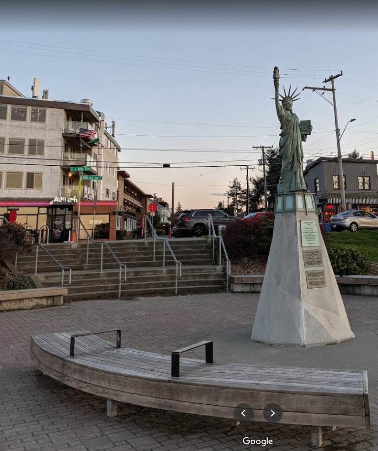
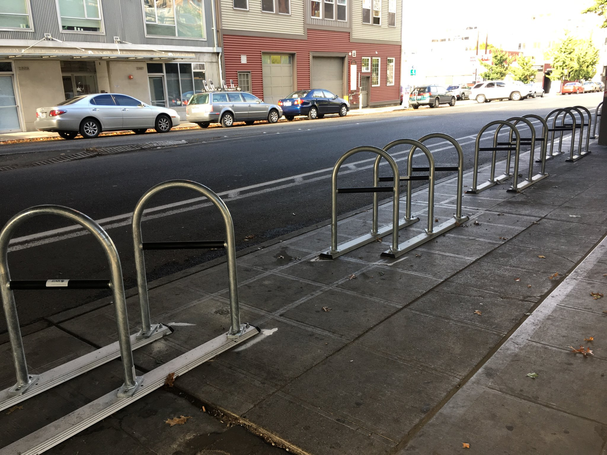
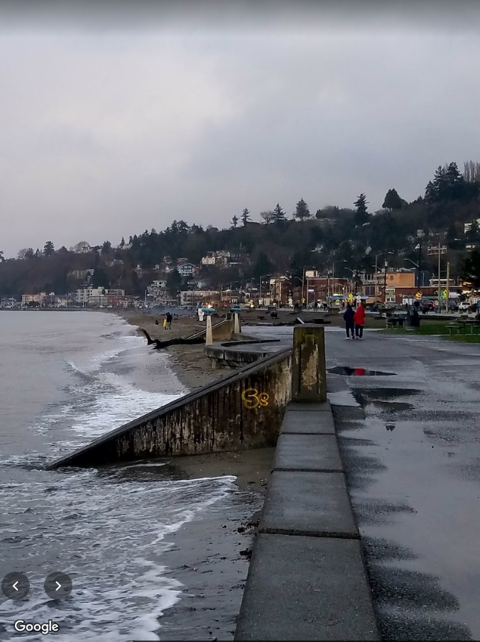
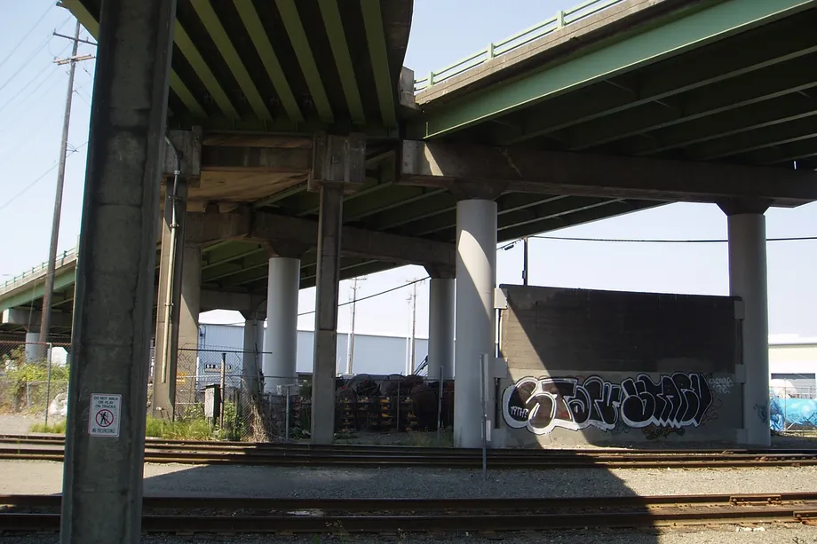
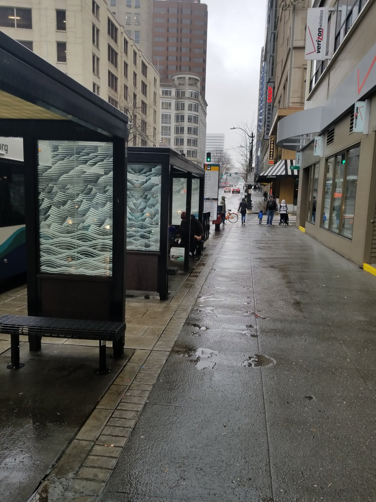

# Seattle's Hostile Architecture and the Impact It Has on Inhabitants and Tourists Alike
### Andrew Garzon, 2021 June 6 1:26 PM PST

It’s no secret that Seattle has been experiencing a lot of economic growth and prosperity. The likes of Amazon, Microsoft, Nintendo of America, and other tech companies have contributed to the city’s booming tech economy rife with computer scientists and software engineers. But at the same time, the high demand for jobs and housing has driven up the prices of mortgage and rent to unaffordable levels for many.

The average rent for an apartment across Seattle in February 2021 is $1,872, which is a little more than half that of Manhattan Island, averaging around $3,615. Around ten years ago, the average rent in Seattle barely broke a grand. Many couldn’t keep up with the rising rent prices and as such were forced out of their homes. Combine that with the lack of affordable housing, and it brews a perfect storm for people to fall into homelessness.

Worse yet, Seattle has a bad track record of trying to herd around its population of people experiencing homelessness by making many places inhospitable or otherwise inaccessible for people to set up tents or sleep for the night. The fact that the city even put effort into this gives one an idea of the city’s response to a situation like this. Not only does it make the city inhospitable for people in hard times, it makes the city inhospitable for everyone else, its own residents included.

I’ve toured around the city to find examples of such “hostile architecture”; it comprises architectural designs intentionally engineered to limit one’s sense of “being” in a particular place, which directly contradicts the idea of parks and buildings being public areas. Not only do they make it hard for those experiencing homelessness to find a place to rest, they also make it hard for the rest of us to enjoy these areas that should be free to everyone. And frankly, doing this just wastes time, money, and resources that could have been better used to actually aid people in need, so it really reflects poorly on the intentions of city management.

This is a photo of the Statue of Liberty on Alki Beach in Seattle. Notice the bench in the foreground, and the metal armrests on the bench. This was designed so as to deter people from sleeping on them. You’d have to be pretty short in order to fit in between those bars, and it makes them a bit uncomfortable should the bench ever be crowded. Especially on a hot summer day, they’ll probably burn you since they’re made of metal. And who’s going to be sitting on or holding onto these things? It doesn’t make any sense at all. That metal could have been used to build a homeless shelter instead of trying to limit where they can sleep.

Speaking of limiting where the unhoused can sleep, I mentioned that Seattle is pretty notorious for clearing out homeless encampments and then putting up some kind of barrier to prevent it from happening again. This never solves the issue; it’s just a constant game of cat-and-mouse since those who are displaced will simply find someplace else to sleep, until there are no places left for either them or the rest of us to be at peace. Here’s another such example that gained attention a few years back:

In early 2018, Seattle installed these bike racks underneath a Highway 99 overpass after the Seattle Police Department cleared out a homeless camp there, to deter future camps from forming. Many have criticised the bike racks for being in an unnecessary location where no one would think to park their bikes, added purely to keep people out. It really makes me think, “why put all this time and effort into trying to herd around those experiencing homelessness instead of actually giving them resources and a place to stay?” What is going on in the minds of city council members that either allow this to happen or completely overlook it? Why isn’t anyone in power speaking up about this? It gives the impression that either they don't care, or they dislike those that are homeless, both of which reflect poorly on them.

Animosity against the Seattle Police Department was already brewing when people saw them clearing out homeless camps, with resentment going into full overdrive after the George Floyd protests a year back. It’s not uncommon to see a sticker saying “Defund SPD” on a street sign in the city, and frankly their funding should go to help those who are homeless, not kick them out of an area.

Also on Alki beach is something very subtle but annoying nonetheless: the gaps between the concrete blocks that line the walk along the shore. This deters skaters from grinding on these blocks and makes it really dangerous to do so. It doesn't make sense in this situation, because these concrete slabs are constantly exposed to the elements and being worn down every day, so trying to prevent grinding on them is a bit of a fruitless endeavour when they're going to have to be replaced every so often anyway. It would be reasonable if it were something like a public work of art, but in this case, it's unnecessary.

The fences they've been putting up under these freeways are getting ridiculous. They've been clearing out camps of people living in tents left and right as of recent and fencing them off so they can't stay there anymore. As I've said before, this doesn't solve the problem, it just pushes it elsewhere, and in the end, everything is going to be fenced off and no one will be able to enjoy anything anymore.

Probably the most visible and widespread example of hostile architecture in Seattle: the bus stops. The benches are short in height, length, and width, and the covering barely protects one from the weather, much less if it’s raining sideways. Not only would it be uncomfortable for people experiencing homelessness to find shelter here, it makes waiting for the bus pretty unbearable when it rains 9 months out of the year. You don’t really see this outside of Downtown, which really makes you wonder what they were thinking when they designed these.

I think it’s about time to let the city council know that enough is enough. Their efforts to try to control where people can and cannot stay are inconveniencing the entire city and it needs to stop. Kicking those without a home off a bench and then not offering them a place to sleep is an extremely cold-hearted thing to do, and ultimately it causes more problems than it solves, not only for them, but for the rest of us as well. Our city is becoming less and less friendly to natives and visitors alike, and if not reversed, not even those who live here will want to enjoy what it all has to offer, as parks will be closed after dark and places will be fenced off to everyone. We need to tell Jenny Durkan, M. Lorena González, and anyone else involved in Seattle’s operations that this needs to end right now, that they need to divert efforts into rehabilitating those experiencing homelessness, and to make our cities more livable and enjoyable for everyone’s benefit.

You can email them at council@seattle.gov, or write to their mailing address at PO Box 34025, Seattle, WA 98124-4025. The clock is ticking.
